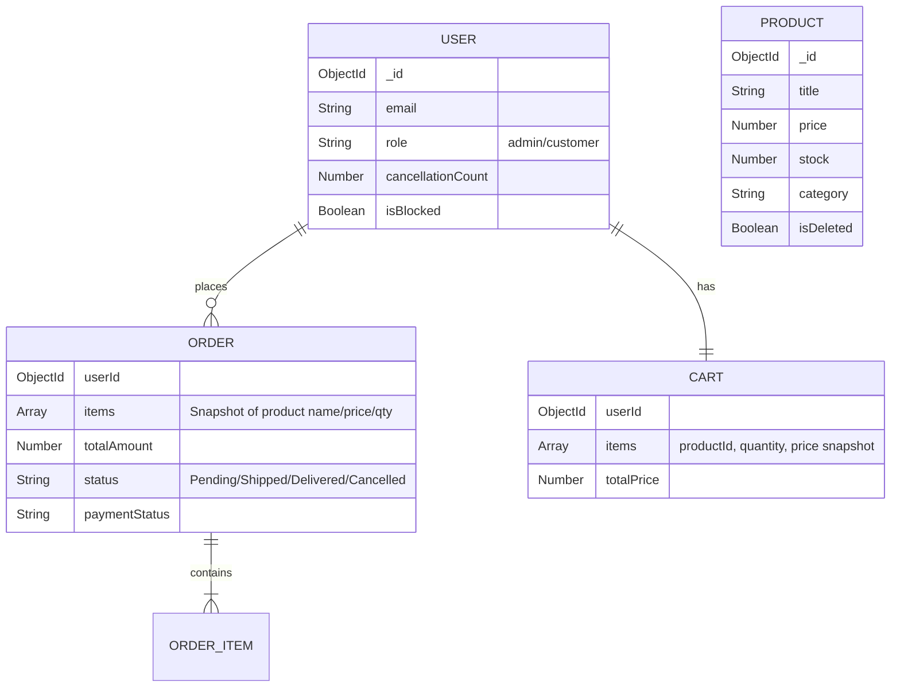

```md
# Mini E-Commerce API 🚀

A production-style, RESTful backend API for a mini e-commerce platform. It covers the essential workflows of an online shop: authentication, role-based access control, product management, cart operations, and transactional order processing with stock safety.

Built with **Node.js**, **Express**, and **MongoDB**.

---

## 🔗 Live API Deployment

**Base URL (deployed):** https://ecommerceapi-pg15.onrender.com  
**API Prefix:** `/api`

Example:

```

GET [https://ecommerceapi-pg15.onrender.com/api/products](https://ecommerceapi-pg15.onrender.com/api/products)

```

---

## 📌 Project Overview

This backend is designed to be **simple but correct**: consistent stock updates, safe order placement, and practical guardrails against cancellation abuse.

### ✅ Key Features

#### 🔐 Authentication & Authorization
- JWT-based authentication
- RBAC (Role-Based Access Control) with two roles: `admin` and `customer`

**Protected admin registration (prevents role escalation):**
- Customers cannot self-upgrade to admin
- Admin registration can be protected via `ADMIN_SIGNUP_KEY` (optional)
  - When enabled, admin registration requires the `x-admin-signup-key` header (or `adminKey` in body)

#### 📦 Product Management
- Admin-only product CRUD
- Soft delete (`isDeleted`) to preserve historical order records
- Public product listing supports:
  - Search (`q`)
  - Category filter (`category`)
  - Price filters (`minPrice`, `maxPrice`)
  - Pagination (`page`, `limit`)
  - Sorting (`sort`, e.g. `-price`, `price`, `-createdAt`)

Example:

```

GET /api/products?q=laptop&category=Tech&minPrice=100&maxPrice=2000&page=1&limit=20&sort=-price

````

#### 🛒 Cart
- Persistent cart per user
- Add items to cart (supports incrementing quantity)
- Update cart item quantity via `PATCH` (set absolute quantity; `0` removes item)
- Remove cart items via `DELETE`
- Cart totals are recalculated server-side

#### 🧾 Orders
- Transactional order placement using **MongoDB transactions (ACID)** (replica set required)
- Checkout verifies stock in real-time and prevents negative inventory
- Orders snapshot item name/price/quantity at purchase time
- Admin-only order status updates

> Note: In the current codebase, status updates accept allowed enum values. If you want strict transition enforcement (`Pending → Shipped → Delivered`), implement it in `orderController.updateStatus`.

#### 🛡️ Fraud Prevention (Bonus)
- Anti stock-hoarding throttling:
  - Users cancelling orders repeatedly (>3) are automatically flagged and blocked
  - Block enforcement happens during login and can be extended to all protected routes if you choose
- Cancellation behavior:
  - Cancellation is blocked for `Shipped` / `Delivered` orders
  - Admin can cancel any eligible order without triggering fraud penalties

#### 🔒 Lightweight Security Hardening (Bonus)
- Rate limiting on `/api` routes
- Mongo query operator sanitization (basic injection prevention)
- Helmet security headers

---

## 🛠️ Tech Stack

- **Runtime:** Node.js  
- **Framework:** Express.js  
- **Database:** MongoDB (Mongoose ODM)  
- **Authentication:** JSON Web Tokens (JWT) & Bcrypt  
- **Validation:** Express-Validator  
- **Security:** Helmet, Express Rate Limit, Express Mongo Sanitize  

---

## 📂 Project Structure

Modular **MVC** architecture for clarity and maintainability.

```text
src/
├── config/           # Database connections & environment config
├── controllers/      # Business logic (Req/Res handling)
├── middleware/       # Auth, Validation, Error handling, Role checks
├── models/           # Mongoose Schemas (User, Product, Cart, Order)
├── routes/           # API Endpoint definitions
├── utils/            # Reusable helpers (Async wrappers, Custom Errors)
├── app.js            # Express app setup (Middleware wiring)
└── server.js         # Entry point (Server listener)
````

---

## 🏗️ Database Schema (ER Diagram)



---

## 🧠 Key Architectural Decisions

### 1) Atomic Transactions (ACID)

* **Problem:** Crashes or partial writes can create inconsistent inventory.
* **Solution:** Use `mongoose.startSession()` to wrap stock deduction, order creation, and cart clearing in a single transaction.

### 2) Data Snapshots in Orders

* **Problem:** Product price/name can change after purchase.
* **Solution:** Snapshot `name`, `price`, and `quantity` into `Order.items[]`.

### 3) Stock-Safe Checkout

* **Problem:** Race conditions can cause overselling.
* **Solution:** Validate stock at checkout and deduct stock inside the same transaction so stock never becomes negative.

### 4) Cancellation Throttling (Fraud Logic)

* **Problem:** Users can reserve stock and cancel repeatedly to block others.
* **Solution:** Track `cancellationCount` and auto-block after excessive cancellations.

---

## 📝 Assumptions

* Stock is **not reserved** at cart time; deduction occurs at checkout.
* Prices are numeric in a single currency.
* Product removal is a **soft delete** to protect historical orders.

---

## 🚀 Getting Started

### Prerequisites

* Node.js (v14+ recommended)
* MongoDB (Local or Atlas)

### Installation

1. **Clone the repository**

```bash
git clone https://github.com/smri29/Mini-E-Commerce-API.git
cd Mini-E-Commerce-API
```

2. **Install dependencies**

```bash
npm install
```

3. **Environment Configuration**
   Create a `.env` file in the root directory:

```env
PORT=5000
MONGO_URI=your_mongodb_connection_string
JWT_SECRET=your_super_secret_key_123
JWT_EXPIRES_IN=30d
ADMIN_SIGNUP_KEY=some_long_random_secret  # optional (only if you want protected admin signup)
NODE_ENV=development
```

4. **Run the server**

```bash
# Development mode
npm run dev

# Production mode
npm start
```

---

## 📖 API Documentation

### Postman Collection

A ready-to-use Postman collection is included.

* **File:** `docs/postman/Mini E-Commerce API.postman_collection.json`
* **How to use:** see `docs/POSTMAN.md`

---

## 🔌 Endpoints

### Authentication

* `POST /api/auth/register` — Register a new user

  * Default role: `customer`
  * Admin registration may require `x-admin-signup-key` (or `adminKey`) if enabled
* `POST /api/auth/login` — Login and receive JWT

### Products

* `GET /api/products` — List products (**supports filters/search/pagination**)
  Query params: `q`, `category`, `minPrice`, `maxPrice`, `page`, `limit`, `sort`
* `GET /api/products/:id` — Get single product
* `POST /api/products` — Create product (**Admin only**)
* `PUT /api/products/:id` — Update product (**Admin only**)
* `DELETE /api/products/:id` — Soft delete product (**Admin only**)

### Cart (Customer)

* `GET /api/cart` — View my cart
* `POST /api/cart` — Add item to cart (increments quantity)
* `PATCH /api/cart/:itemId` — Set item quantity (`0` removes item)
* `DELETE /api/cart/:itemId` — Remove item from cart

### Orders

* `POST /api/orders` — Place order (**Transactional**)
* `GET /api/orders` — My order history
* `PUT /api/orders/:id/cancel` — Cancel order (rules apply)
* `PUT /api/orders/:id/status` — Update order status (**Admin only**)

---

## 🧪 Testing

This repo includes minimal integration tests (Jest + Supertest) that validate:

1. Auth (register/login)
2. RBAC (admin-only product creation)
3. Transactional checkout (cart → order → stock decrement)

Run tests:

```bash
npm test
```

Manual testing notes are in:

* `docs/TESTING.md`

---

## 📜 License

This project is open-source and available under the MIT License.

---

```
::contentReference[oaicite:0]{index=0}
```
