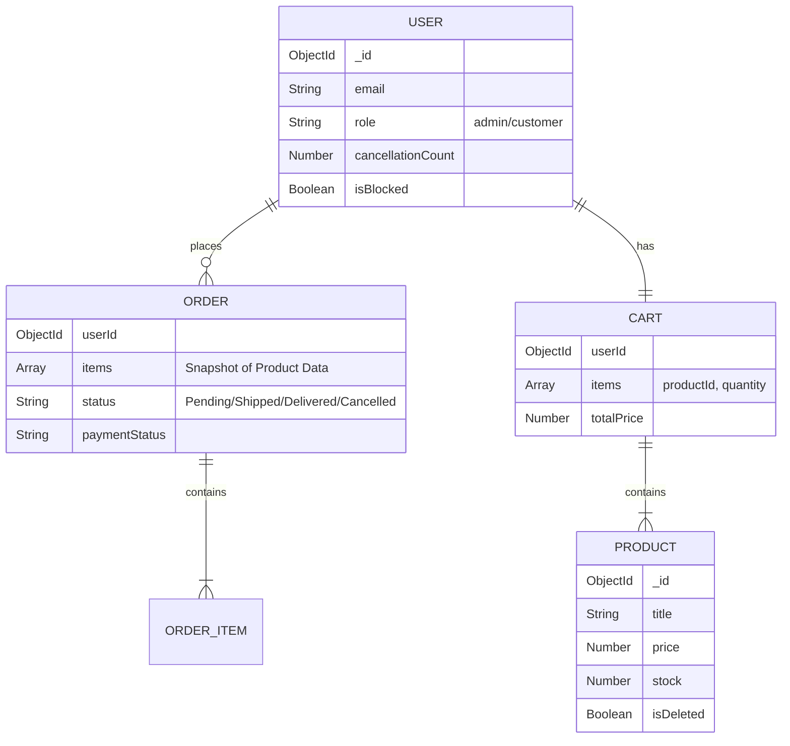

# Mini E-Commerce API 🚀

A robust, RESTful backend API for a mini e-commerce platform. This project simulates core online shopping features including authentication, role-based access control, product management, cart operations, and secure order processing.

Built with **Node.js**, **Express**, and **MongoDB**.

---

## 🔗 Live API Deployment

**URL:** [https://ecommerceapi-pg15.onrender.com](https://ecommerceapi-pg15.onrender.com) 

---

## 📌 Project Overview

This system is designed to handle high-concurrency e-commerce operations with a focus on **data consistency** and **fraud prevention**.

### Key Features

* **🔐 Authentication & Authorization:**
* JWT-based secure authentication.


* 
**RBAC (Role-Based Access Control):** distinct permissions for `Admin` and `Customer`.


* **📦 Product Management:**
* Admin-only CRUD operations for products.


* **Soft Delete:** Products are flagged as deleted rather than removed to preserve historical order data.


* **🛍️ Cart & Orders:**
* Persistent database-backed shopping cart.


* 
**Atomic Order Placement:** Uses **MongoDB Transactions (ACID)** to ensure stock is only deducted after successful order creation.


* **🛡️ Fraud Prevention (Bonus):**
* 
**Anti-Stock-Hoarding:** Implements a throttling mechanism. Users who cancel orders repeatedly (>3 times) are automatically flagged and blocked to prevent stock manipulation.


* 
**Negative Inventory Protection:** Strict validation ensures stock never drops below zero.


---

## 🛠️ Tech Stack

* 
**Runtime:** Node.js 


* 
**Framework:** Express.js 


* 
**Database:** MongoDB (Mongoose ODM) 


* 
**Authentication:** JSON Web Tokens (JWT) & Bcrypt 


* 
**Validation:** Express-Validator 


---

## 📂 Project Structure

The project follows a modular **MVC (Model-View-Controller)** architecture to ensure scalability and maintainability.

```text
src/
├── config/           # Database connections & environment config
├── controllers/      # Business logic (Req/Res handling)
├── middleware/       # Auth, Error handling, & Role validation
├── models/           # Mongoose Schemas (User, Product, Cart, Order)
├── routes/           # API Endpoint definitions
├── utils/            # Reusable helper functions (Async wrappers, Custom Errors)
├── app.js            # Express app setup (Middleware wiring)
└── server.js         # Entry point (Server listener)

```

---

## 🏗️ Database Schema (ER Diagram)

The application uses a normalized NoSQL structure with the following relationships:



---

## 🧠 Key Architectural Decisions

1. **Atomic Transactions (ACID):**
* 
**Problem:** If a server crashes after creating an order but before deducting stock, inventory becomes inaccurate. 


* 
**Solution:** We use `mongoose.startSession()` to wrap the *Order Creation*, *Stock Deduction*, and *Cart Clearing* into a single atomic transaction. 


2. **Data Snapshots in Orders:**
* **Problem:** If a product price changes later, old order history should not reflect the new price.
* 
**Solution:** When an order is created, we snapshot the `price` and `name` of the product into the `OrderItems` array. 


3. **Cancellation Throttling (Fraud Logic):**
* 
**Problem:** Malicious users can reserve stock via orders and cancel them repeatedly to deny stock to others. 


* **Solution:** The user model tracks `cancellationCount`. Exceeding 3 cancellations triggers an automatic `isBlocked` flag.


---

## 📝 Assumptions Made

1. 
**Stock Reservation:** Stock is **not** reserved when added to the Cart. Real deduction happens strictly at the **Order Placement** stage.


2. 
**Currency:** All prices are treated as integers/floats in a single currency unit for simplicity.


3. 
**Deletion:** "Deleting" a product performs a **Soft Delete** to ensure that historical orders referencing that product remain valid.


---

## 🚀 Getting Started

Follow these steps to set up the project locally.

### Prerequisites

* [Node.js](https://nodejs.org/) (v14+ recommended)
* [MongoDB](https://www.mongodb.com/try/download/community) (Local or Atlas)

### Installation

1. **Clone the repository:**
```bash
git clone https://github.com/smri29/Mini-E-Commerce-API.git
cd Mini-E-Commerce-API

```


2. **Install dependencies:**
```bash
npm install

```


3. **Environment Configuration:**
Create a `.env` file in the root directory and add:
```env
PORT=5000
MONGO_URI=your_mongodb_connection_string
JWT_SECRET=your_super_secret_key_123
NODE_ENV=development

```


4. **Run the server:**
```bash
# Development mode
npm run dev

# Production mode
npm start

```


---

## 📖 API Documentation

### **Postman Collection**

A pre-configured Postman collection is available for testing in the `docs/` folder.

* **File:** `docs/postman/Mini-Ecommerce-API.postman_collection.json`

**Endpoints** 

#### **Authentication**

* 
`POST /api/auth/register` - Register a new user.


* 
`POST /api/auth/login` - Login and receive JWT.


#### **Products**

* `GET /api/products` - List all products.
* 
`POST /api/products` - Add new product (**Admin only**).


* 
`PUT /api/products/:id` - Update product (**Admin only**).


* 
`DELETE /api/products/:id` - Delete product (**Admin only**).


#### **Cart**

* `GET /api/cart` - View user's cart.
* 
`POST /api/cart` - Add item to cart.


* 
`DELETE /api/cart/:itemId` - Remove item from cart.


#### **Orders**

* 
`POST /api/orders` - Place an order (**Transactional**).


* `GET /api/orders` - View order history.
* 
`PUT /api/orders/:id/cancel` - Cancel order.


---

## 🧪 Testing

```bash
npm test

```

## 📜 License

This project is open-source and available under the [MIT License](https://opensource.org/licenses/MIT).

---