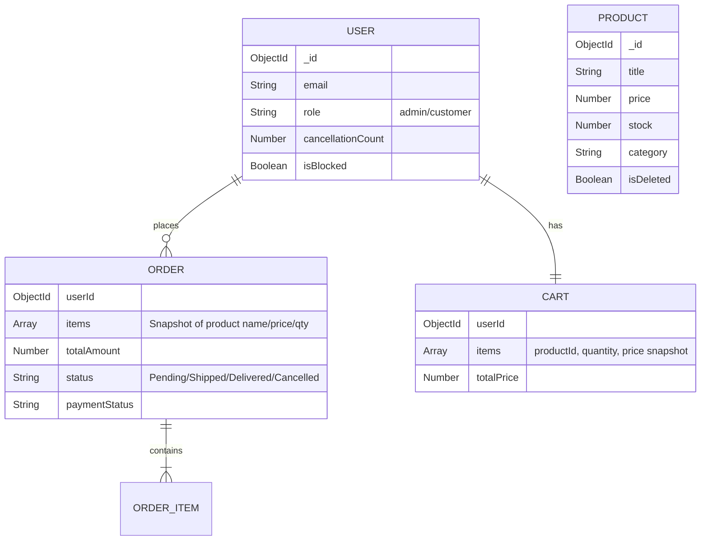

# Mini E-Commerce API 🚀

A production-style REST API for a mini e-commerce platform. It covers core backend workflows: authentication, role-based access control, product management, cart operations, and transactional order processing with stock safety.

Built with **Node.js**, **Express**, and **MongoDB (Mongoose)**.

---

## Live API Deployment

- **Base URL (deployed):** https://ecommerceapi-pg15.onrender.com
- **API Prefix:** `/api`

Quick check:

- Live (deployed):
  - https://ecommerceapi-pg15.onrender.com/api/products

```bash
curl -s https://ecommerceapi-pg15.onrender.com/api/products
```

---

## What This Project Includes

This backend is designed to be **simple but correct**: consistent stock updates, safe order placement, and practical guardrails against cancellation abuse.

---

## Key Features

### Authentication & Authorization

* JWT-based authentication
* RBAC with two roles: `admin` and `customer`

**Protected admin registration (prevents role escalation):**

* Customers cannot self-upgrade to admin
* Admin registration can be protected with `ADMIN_SIGNUP_KEY` (optional)

  * When enabled, admin signup requires either:

    * `x-admin-signup-key` header, or
    * `adminKey` in the request body

### Product Management

* Admin-only product CRUD
* Soft delete (`isDeleted`) to preserve historical order records
* Public product listing supports:

  * Search (`q`)
  * Category filter (`category`)
  * Price filters (`minPrice`, `maxPrice`)
  * Pagination (`page`, `limit`)
  * Sorting (`sort`, e.g. `-price`, `price`, `-createdAt`)

Example:

```bash
curl "http://localhost:5000/api/products?q=laptop&category=Tech&minPrice=100&maxPrice=2000&page=1&limit=20&sort=-price"
```

### Cart

* One persistent cart per user
* Add items (supports incrementing quantity)
* Update item quantity via `PATCH` (set absolute quantity; `0` removes item)
* Remove cart items via `DELETE`
* Cart totals are recalculated server-side

### Orders

* Transactional order placement using **MongoDB transactions (ACID)**

  * Replica set required (MongoDB Atlas works; local MongoDB needs replica set enabled)
* Checkout verifies stock in real-time and prevents negative inventory
* Orders snapshot item `name` / `price` / `quantity` at purchase time
* Admin can update order status

> Note: The current code accepts any allowed enum value for order status.
> If you want strict status transitions (e.g., `Pending → Shipped → Delivered`), add transition validation in `orderController.updateStatus`.

### Fraud Prevention (Bonus)

* Anti stock-hoarding throttling:

  * Users cancelling orders repeatedly (>3) are automatically flagged and blocked
* Cancellation behavior:

  * Cancellation is blocked for `Shipped` / `Delivered` orders
  * Admin can cancel eligible orders without triggering fraud penalties

### Security Hardening (Bonus)

* Rate limiting on `/api` routes
* Mongo query operator sanitization (basic injection prevention)
* Helmet security headers

---

## Tech Stack

* **Runtime:** Node.js
* **Framework:** Express.js
* **Database:** MongoDB (Mongoose ODM)
* **Auth:** JWT + Bcrypt
* **Validation:** Express-Validator
* **Security:** Helmet, Express Rate Limit, Express Mongo Sanitize

---

## Project Structure

```text
src/
├── config/           # Database connection & config
├── controllers/      # Business logic (req/res handling)
├── middleware/       # Auth, validation, error handling, role checks
├── models/           # Mongoose schemas (User, Product, Cart, Order)
├── routes/           # Route definitions
├── utils/            # Helpers (async wrapper, custom errors)
├── app.js            # Express app setup (middleware + routes)
└── server.js         # Entry point (server boot)
```

---

## Database Schema (ER Diagram)



---

## Key Architectural Decisions

### 1) Transactions for Checkout (ACID)

* Prevents partial writes and inconsistent inventory
* Uses `mongoose.startSession()` so stock deduction, order creation, and cart clearing happen atomically

### 2) Snapshotting Order Items

* Order history should not change if product title/price changes later
* Orders store `name`, `price`, and `quantity` in `Order.items[]`

### 3) Stock Safety

* Stock is re-validated at checkout and deducted inside the same transaction
* Prevents negative inventory during concurrent checkouts

### 4) Cancellation Throttling

* Repeated cancellations can be used to hoard stock
* Tracks `cancellationCount` and blocks users after excessive cancellations

---

## Assumptions

* Stock is **not reserved** when added to cart; stock is deducted at checkout
* Prices are numeric in a single currency unit
* Products use **soft delete** to preserve past order integrity

---

## Getting Started (Local Setup)

### Prerequisites

* Node.js (v14+ recommended)
* MongoDB (Local or Atlas)

### Installation

1. Clone:

```bash
git clone https://github.com/smri29/Mini-E-Commerce-API.git
cd Mini-E-Commerce-API
```

2. Install:

```bash
npm install
```

3. Create `.env` in the project root:

```env
PORT=5000
MONGO_URI=your_mongodb_connection_string
JWT_SECRET=your_super_secret_key_123
JWT_EXPIRES_IN=30d
ADMIN_SIGNUP_KEY=some_long_random_secret  # optional (only if you want protected admin signup)
NODE_ENV=development
```

4. Run:

```bash
npm run dev
```

---

## API Documentation

### Postman Collection

* **File:** `docs/postman/Mini E-Commerce API.postman_collection.json`
* **Usage guide:** `docs/POSTMAN.md`

---

## Endpoints

### Auth

* `POST /api/auth/register` — Register a user

  * Default role: `customer`
  * Admin signup may require `x-admin-signup-key` (or `adminKey`) if enabled
* `POST /api/auth/login` — Login and receive JWT

### Products

* `GET /api/products` — List products (filters/search/pagination)

  * Query: `q`, `category`, `minPrice`, `maxPrice`, `page`, `limit`, `sort`
* `GET /api/products/:id` — Get single product
* `POST /api/products` — Create product (**Admin only**)
* `PUT /api/products/:id` — Update product (**Admin only**)
* `DELETE /api/products/:id` — Soft delete product (**Admin only**)

### Cart (Customer)

* `GET /api/cart` — View my cart
* `POST /api/cart` — Add item (increments quantity)
* `PATCH /api/cart/:itemId` — Set quantity (`0` removes item)
* `DELETE /api/cart/:itemId` — Remove item

### Orders

* `POST /api/orders` — Place order (**Transactional**)
* `GET /api/orders` — My order history
* `PUT /api/orders/:id/cancel` — Cancel order (rules apply)
* `PUT /api/orders/:id/status` — Update order status (**Admin only**)

---

## Testing

This repo includes minimal integration tests (Jest + Supertest) that validate:

1. Auth (register/login)
2. RBAC (admin-only product creation)
3. Transactional checkout (cart → order → stock decrement)

Run:

```bash
npm test
```

Manual testing notes:

* `docs/TESTING.md`

---

## License

MIT
