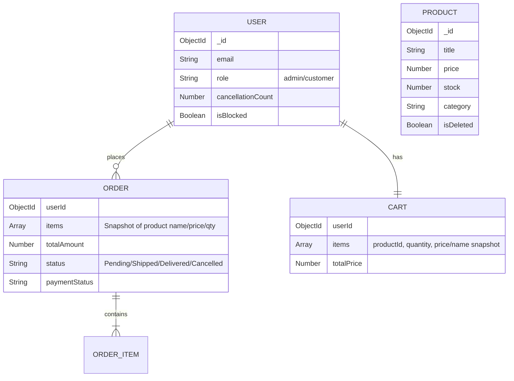

# Mini E-Commerce API 🚀

A production-style REST API for a mini e-commerce platform.  
It covers core backend workflows: authentication, role-based access control, product management, cart operations, and transactional order processing with stock safety.

Built with **Node.js**, **Express**, and **MongoDB (Mongoose)**.

---

## Live API Deployment

- **Base URL (deployed):** `https://ecommerceapi-pg15.onrender.com`
- **API Prefix:** `/api`

Quick check:

```bash
curl -s https://ecommerceapi-pg15.onrender.com/api/products
```

---

## What This Project Includes

This backend is designed to be simple but correct:

- clean auth + RBAC boundaries
- safe stock handling
- transactional checkout
- guarded order cancellation logic
- practical API hardening

---

## Key Features

## 1) Authentication & Authorization

- JWT-based authentication
- RBAC with two roles: `admin`, `customer`
- Protected-route enforcement via auth middleware
- Blocked accounts are denied protected endpoints

### Protected Admin Registration (role escalation guard)

Customers cannot self-upgrade to admin.

If `ADMIN_SIGNUP_KEY` is configured, admin signup requires a valid key via:

- `x-admin-signup-key` header, or
- `adminKey` in request body

---

## 2) Product Management

- Admin-only product CRUD
- Soft delete (`isDeleted`) to preserve order history integrity
- Public product listing supports:
  - search (`q`)
  - category filter (`category`)
  - price filter (`minPrice`, `maxPrice`)
  - pagination (`page`, `limit`)
  - sorting (`sort`, e.g. `-price`, `price`, `-createdAt`)

Example:

```bash
curl "http://localhost:5000/api/products?q=laptop&category=Tech&minPrice=100&maxPrice=2000&page=1&limit=20&sort=-price"
```

---

## 3) Cart

- One persistent cart per user
- Add items (auto-increment quantity if product already exists in cart)
- Update quantity via `PATCH /api/cart/:itemId` (absolute quantity)
- Quantity `0` removes item
- Server-side total recalculation on save

---

## 4) Orders

- Transactional checkout using MongoDB transactions (ACID)
- Stock validated at checkout and decremented atomically
- Order item snapshot stores `name`, `price`, `quantity`
- Cart is cleared only after successful transaction commit

### Status transition rules

Only valid transitions are allowed:

- `Pending -> Shipped`
- `Shipped -> Delivered`
- `Pending -> Cancelled`

Invalid transitions are rejected.

---

## 5) Cancellation & Anti-Abuse Logic

Customer cancellation rules:

- only `Pending` orders
- only within 1 hour of creation

Additional rules:

- cannot cancel `Shipped` or `Delivered` orders
- repeated cancellations increase `cancellationCount`
- excessive cancellations can flag/block the account

---

## 6) Security Hardening

- `helmet` security headers
- rate limiting on `/api`
- `express-mongo-sanitize` for basic query operator sanitization
- payload size limits on JSON/urlencoded input

---

## Tech Stack

- **Runtime:** Node.js
- **Framework:** Express.js
- **Database:** MongoDB (Mongoose)
- **Auth:** JWT + Bcrypt
- **Validation:** express-validator
- **Testing:** Jest + Supertest + mongodb-memory-server
- **Security:** Helmet, Express Rate Limit, Express Mongo Sanitize

---

## Project Structure

```text
src/
├── config/           # DB connection
├── controllers/      # Business logic
├── middleware/       # Auth, validation, error handling, RBAC
├── models/           # User, Product, Cart, Order schemas
├── routes/           # Route modules
├── utils/            # ApiError, async wrapper, helpers
├── app.js            # Express app config + routes
└── server.js         # Process bootstrap
```

---

## Database Schema (ER Diagram)



---

## Architectural Decisions

### 1) Transactional Checkout (ACID)

Checkout operations happen in one transaction:

- stock deduction
- order creation
- cart clearing

Prevents partial writes and inconsistent inventory.

### 2) Snapshotting Order Items

Order history remains stable even if product data changes later.

### 3) Stock Safety

Stock is validated and updated atomically to prevent negative inventory in concurrent scenarios.

### 4) Role Escalation Guard

Admin account creation is controlled via server-side secret (`ADMIN_SIGNUP_KEY`).

### 5) Cancellation Abuse Control

Repeated cancellations can trigger account blocking.

---

## Assumptions

- Stock is not reserved on add-to-cart; it is verified/deducted at checkout.
- Prices are stored as numeric values in one currency unit.
- Soft-deleted products remain hidden from normal product queries.

---

## Getting Started (Local Setup)

### Prerequisites

- Node.js (v14+ recommended)
- MongoDB (Atlas or local replica-set-enabled instance for transactions)

### Installation

1. Clone:

```bash
git clone https://github.com/smri29/Mini-E-Commerce-API.git
cd Mini-E-Commerce-API
```

2. Install dependencies:

```bash
npm install
```

3. Create `.env` in project root:

```env
PORT=5000
MONGO_URI=your_mongodb_connection_string
JWT_SECRET=your_super_secret_key_123
JWT_EXPIRES_IN=30d
ADMIN_SIGNUP_KEY=some_long_random_secret
NODE_ENV=development
```

> If `ADMIN_SIGNUP_KEY` is omitted, admin signup protection behavior depends on controller logic.

4. Run:

```bash
npm run dev
```

---

## API Documentation

## Postman Collection

- Collection file: `docs/postman/Mini E-Commerce API.postman_collection.json`
- Usage guide: `docs/POSTMAN.md`

---

## Endpoints

## Health

- `GET /` — service status check

## Auth

- `POST /api/auth/register` — Register user (default role: customer)
- `POST /api/auth/login` — Login and receive JWT

## Products

- `GET /api/products` — List products (search/filter/pagination/sort)
- `GET /api/products/:id` — Get single product
- `POST /api/products` — Create product (**Admin only**)
- `PUT /api/products/:id` — Update product (**Admin only**)
- `DELETE /api/products/:id` — Soft delete product (**Admin only**)

## Cart

- `GET /api/cart` — Get my cart
- `POST /api/cart` — Add item
- `PATCH /api/cart/:itemId` — Set item quantity (`0` removes item)
- `DELETE /api/cart/:itemId` — Remove cart item

## Orders

- `POST /api/orders` — Place order (transactional)
- `GET /api/orders` — Get my orders
- `PUT /api/orders/:id/cancel` — Cancel order (rules apply)
- `PUT /api/orders/:id/status` — Update order status (**Admin only**, transition-validated)

---

## Testing

Includes integration tests for core backend guarantees:

1. Auth (register/login)
2. RBAC (admin-only product creation)
3. Transactional checkout (cart → order → stock decrement → cart clear)

Run tests:

```bash
npm test
```

More details:

- `docs/TESTING.md`

---

## License

MIT